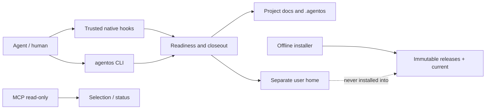

# Архитектура фундамента

## Контекст и границы

Агент/человек → CLI / native hook adapter → project lifecycle → файлы проекта и локальная
пользовательская папка. MCP — отдельная read-only поверхность discovery/planning, не shell.
Сеть не нужна новым project/overlay/hook-командам. Унаследованные функции обновления,
Telegram и speech имеют собственные сетевые зависимости и не являются prerequisite gate.

## Компоненты

|Модуль|Ответственность|Не делает|
|---|---|---|
|project|Анкета, документы, transitions, checks, evidence|Не доказывает бизнес-истину и live deploy|
|doc_catalog|Детерминированная применимость|Не выбирает тип за человека без фактов|
|safeio|Containment, atomic replace, locks, SHA|Не защищает от злонамеренного same-UID процесса|
|hooks / observation|Новый turn, pre-tool guard, stop, read-only receipts|Не OS sandbox и не native trust manager|
|integration|Сохраняющий merge AGENTS/skills/hooks|Не меняет auth/model config или trust store|
|overlay / config|Отдельные пути, import, backup migration|Не читает отсутствующие secrets из архива|
|profile_adapter|0 / 1 / N внешних профилей, inventory, точный выбор и drift check|Не создаёт полномочий и не сливает конфликты автоматически|
|dispatch_gate|Одноразовая привязка legacy dispatch к контракту|Не полноценный Telegram onboarding workflow|
|mcp_server|Шесть planning/status tools|Нет произвольных write/shell tools|
|tools/install|Wheel→venv→probe→atomic current→rollback|Нет service/production изменений|

## Решения (ADR)

ADR-001: version 0.5.0-beta.1: развитие публичной 0.4.0, не механический скачок в 0.99
и не переименование частной ветки. Причина: новая архитектурная граница требует испытания клиента/хоста.

ADR-002: core, user home и project docs физически разделены. Config v5 и overlay v1
версионируются независимо. Env не может переопределить инвариант вложенности.

ADR-003: JSON+Markdown, стандартная библиотека Python; без БД/демона для governance.
Один активный task на проект; локальные mkdir locks защищают нормальные параллельные процессы.
Network filesystems, hostile symlink races, распределённые writers не заявлены поддерживаемыми.

ADR-004: неизменяемые release directories, venv сразу по конечному пути. Venv не переносится
после установки: его entrypoints содержат абсолютный interpreter. Atomic current позволяет откат
без изменения user home. Новый interpreter требует повторного integrate/native trust review.

ADR-005: пользовательские профили хранятся под одним внешним user home и версионируются
отдельно от ядра. Публичный адаптер только проверяет выбранные exact ID, хеши, host binding
и решения конфликтов. Отсутствие профиля — штатное состояние; изменение профиля требует
повторного выбора, но не пересборки ядра.

ADR-005: schema/hash gate структурный; именованный reviewer проверяет содержание и полномочия.
Check receipts не подписаны внешним доверенным ключом, поэтому это traceability, а не доказательство
против злоумышленника с правом записи. Регулируемые среды требуют внешнего append-only audit.

ADR-006: механизм обязателен на поддерживаемом пути, но внешние клиенты не контролируются
из этого Python пакета. Адаптер с отключёнными hooks не называется enforced.
Подключение одного MCP недостаточно для контроля всех действий произвольного агента.

ADR-007: частные интеграции не копируются в публичное ядро. Пользовательские знания остаются
user overlay, исполняемые private providers требуют explicit contract, отдельного review и
пробы на целевом устройстве. Удаление исходного runtime без parity доказательств запрещено.
